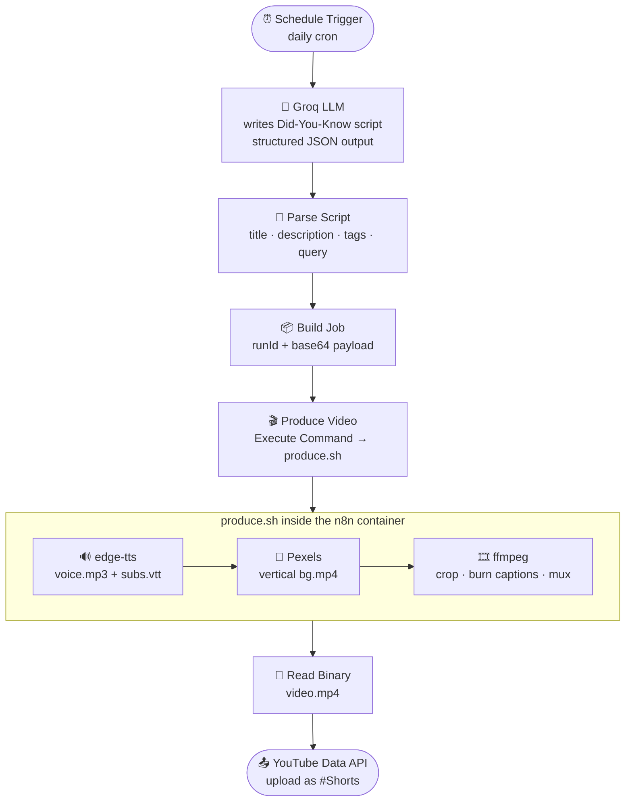

# 🤖 Faceless YouTube Shorts — Fully Automated with n8n

An end-to-end **content automation pipeline** that researches a fact, writes a script,
generates an AI voiceover with word-synced captions, sources a vertical background clip,
renders a finished `1080×1920` video with **ffmpeg**, and **publishes it to YouTube** — on a
schedule, with **zero human input** and **zero recurring cost**.

Built entirely on **self-hosted n8n**. No paid SaaS, no monthly subscriptions, no per-video fees.

> **TL;DR** — A cron fires once a day → an LLM writes a "Did you know?" script → `edge-tts`
> narrates it → Pexels gives a background → ffmpeg burns captions and composes the Short →
> the YouTube Data API uploads it. You wake up, there's a new video on the channel.

---

## ✨ Why this is a strong portfolio piece

- **Real automation, not a toy.** It touches every layer of a production workflow: scheduling,
  LLM prompting with structured output, shelling out to media tooling, binary file handling,
  OAuth2, and error handling.
- **100% free / self-hosted.** Demonstrates you can engineer around paid APIs
  (`edge-tts` instead of ElevenLabs, `ffmpeg` instead of Creatomate/JSON2Video).
- **Reproducible.** `docker compose up` and the whole stack — including ffmpeg and the
  TTS engine — comes online in one command.
- **Extensible.** Swap the niche, the voice, the visual source, or the platform (TikTok,
  Instagram Reels) by editing one node.

---

## 🧱 Architecture



### Pipeline at a glance

| # | Step | Tool | Cost |
|---|------|------|------|
| 1 | Trigger once per day | n8n **Schedule** node | free |
| 2 | Write a viral "Did you know?" script (JSON) | **Groq** API (`llama-3.3-70b`) | free tier |
| 3 | Narrate + word-synced subtitles | **edge-tts** (Microsoft Neural voices) | free, no key |
| 4 | Vertical background footage | **Pexels** API | free |
| 5 | Crop to 9:16, burn captions, mux audio | **ffmpeg** | free |
| 6 | Publish to the channel | **YouTube Data API v3** | free |

---

## 🚀 Quick start (≈15 minutes)

```bash
cd youtube-shorts-automation
cp .env.example .env          # then paste your keys (see SETUP.md)
docker compose up -d --build  # builds n8n + ffmpeg + edge-tts
```

Open **http://localhost:5678**, create the owner account, then:

1. **Import** `workflows/youtube-shorts-automation.json`.
2. Connect the **YouTube OAuth2** credential (Google Cloud → see [docs/SETUP.md](docs/SETUP.md)).
3. Click **Test workflow** to render + upload one video as `private`.
4. Flip the Schedule Trigger to **Active**. Done — it now runs every day.

Full, step-by-step instructions (Google Cloud setup, Groq + Pexels keys, troubleshooting)
live in **[docs/SETUP.md](docs/SETUP.md)**. The design rationale is in
**[docs/ARCHITECTURE.md](docs/ARCHITECTURE.md)**.

---

## 🗂️ Project structure

```
youtube-shorts-automation/
├── docker-compose.yml        # n8n service + volumes
├── Dockerfile                # n8n + ffmpeg + python + edge-tts + fonts
├── .env.example              # API keys & config template
├── scripts/
│   └── produce.sh            # tts → background → ffmpeg compose (the media engine)
├── workflows/
│   └── youtube-shorts-automation.json   # importable n8n workflow
├── data/                     # per-run working dir (gitignored, created at runtime)
├── assets/                   # fonts / optional background music
└── docs/
    ├── SETUP.md              # get every key, connect YouTube, run it
    └── ARCHITECTURE.md       # how & why it's built this way
```

---

## 🔧 Configuration knobs

Everything you'd want to change is one edit away:

| Want to change… | Where |
|---|---|
| Niche / topic / tone | Groq **system prompt** in the *Generate Script* node |
| Voice | `voice` field (`en-US-AriaNeural`, `en-GB-SoniaNeural`, …) returned by the LLM |
| Posting time / frequency | **Schedule Trigger** node |
| Caption style (font, size, position) | `force_style` in `scripts/produce.sh` |
| Visual mood | the `query` the LLM emits → Pexels search |
| public / unlisted / private | `privacyStatus` in the **Upload to YouTube** node |

---

## ⚠️ Responsible use

This publishes automated content. Keep it genuinely useful, fact-check the niche,
respect YouTube's [spam & automation policies](https://support.google.com/youtube/answer/2801973),
and credit stock sources (Pexels). Start with `privacyStatus: private` while you tune it.

---

## 📜 License

MIT — use it, fork it, put it on your résumé.
